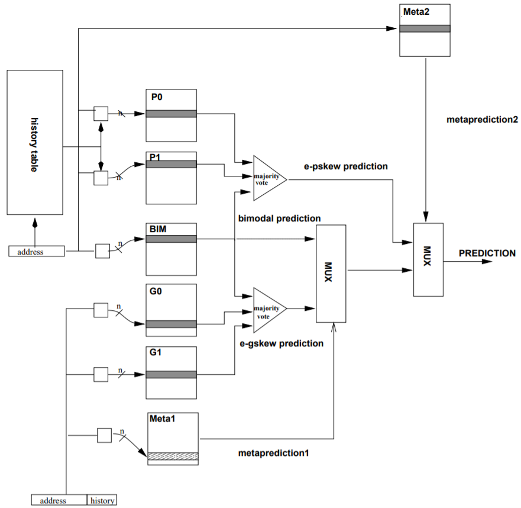

# Branch Predictior Design and Implementation Competition
**Watch a video recording of my presentation of this project here:** https://www.youtube.com/watch?v=VaAOq6UiLT4

This project contains my submission for the branch predictor competition in CSE 6421: Computer Architecture. Code to test the predictor was provided for the class, so the files of interest (i.e. the ones that have code that I wrote) are sim/predictor.cc and sim/predictor.h.

In modern CPU architectures, which have deeply pipelined execution, calculating the outcome of code branches (e.g. if statements) before executing any further instructions is detrimental to performance. Therefore, CPUs employ branch predictors, which try to guess the outcome of a branch -- taken or not taken -- based on the branch instruction's location in the code and previous feedback the branch predictor has received. If the prediction is correct, the execution of instructions can continue without penalty. But if it's incorrect, the subsequent calculations must be invalidated and the performance improvement from the prediction is lost. So, CPU architects must design branch predictors to be as accurate as possible, while keeping their complexity low enough such that they can be implemented in hardware and their predictions can be made quickly.

The purpose of this project was to implement a simulation of a branch predictor based on published research and to achieve the lowest misprediction rate within a 64KB hardware budget. Each branch predictor design was evaluated against a common set of program traces, and the overall misprediction rate was recorded. My solution was based on the 2Bc-gskew-pskew branch predictor design described by Seznec and Michaud (1999), and it ultimately achieved the second best misprediction rate in the class of about a dozen students.

References:
- Original paper that described the 2Bc-gskew-pskew predictor: https://hal.inria.fr/inria-00073060/document
- Further background on de-aliased branch predictors: http://meseec.ce.rit.edu/eecc722-fall2002/papers/branch-prediction/7/michaud97trading.pdf
